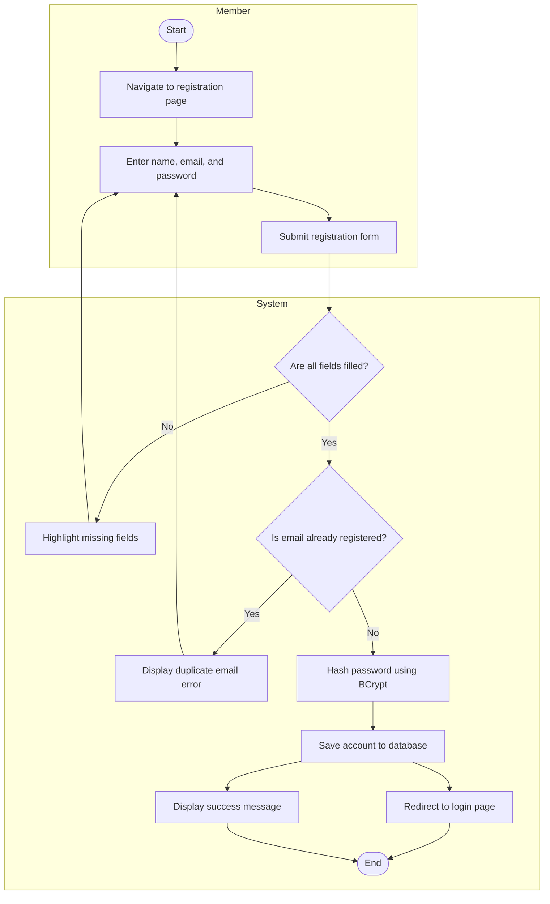
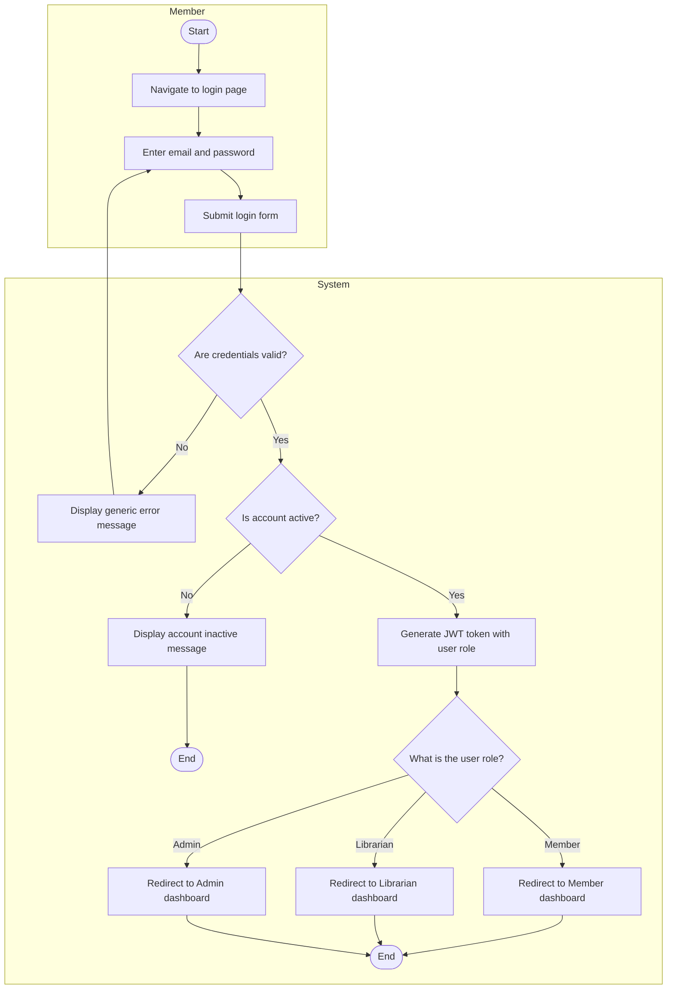
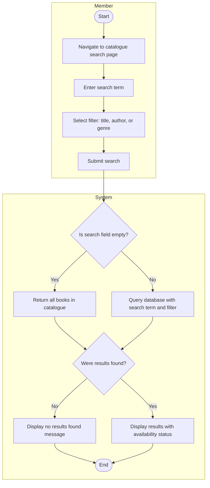
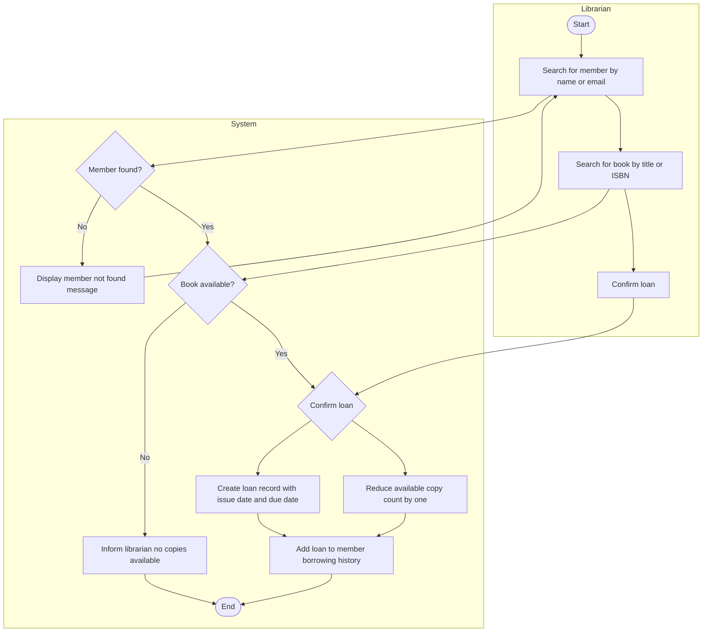
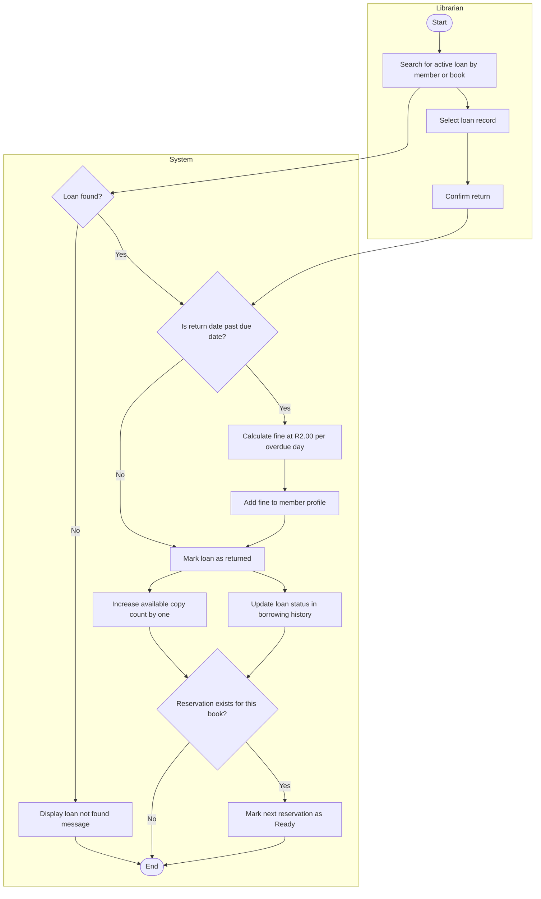
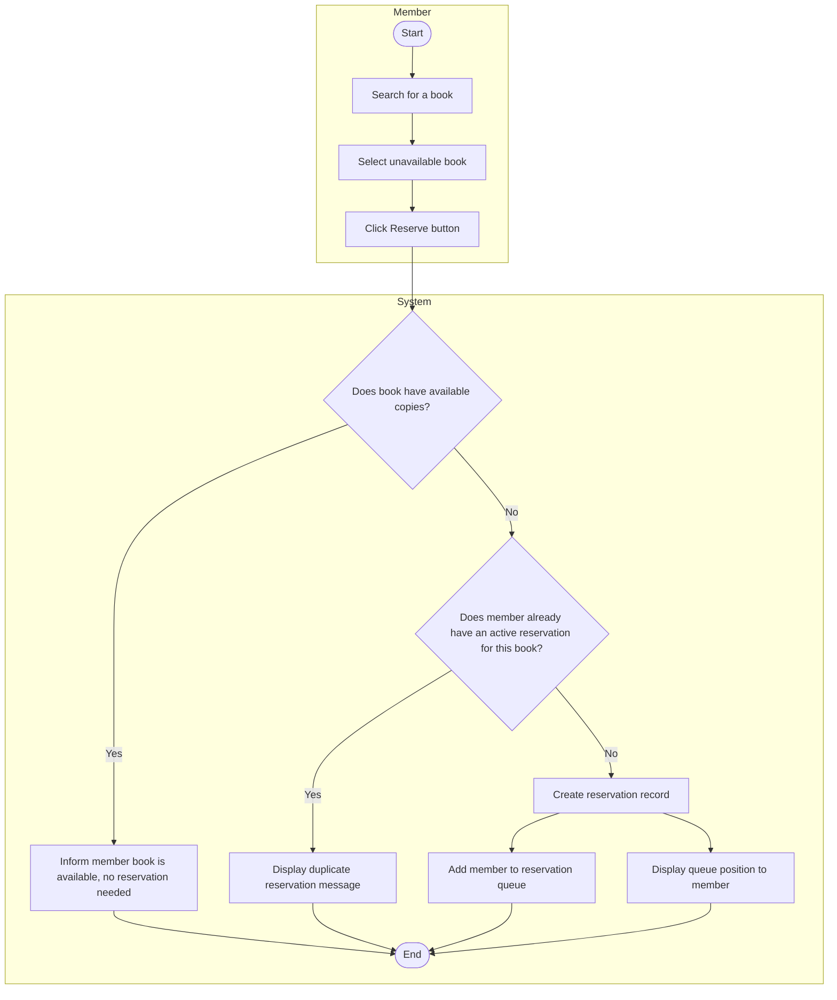
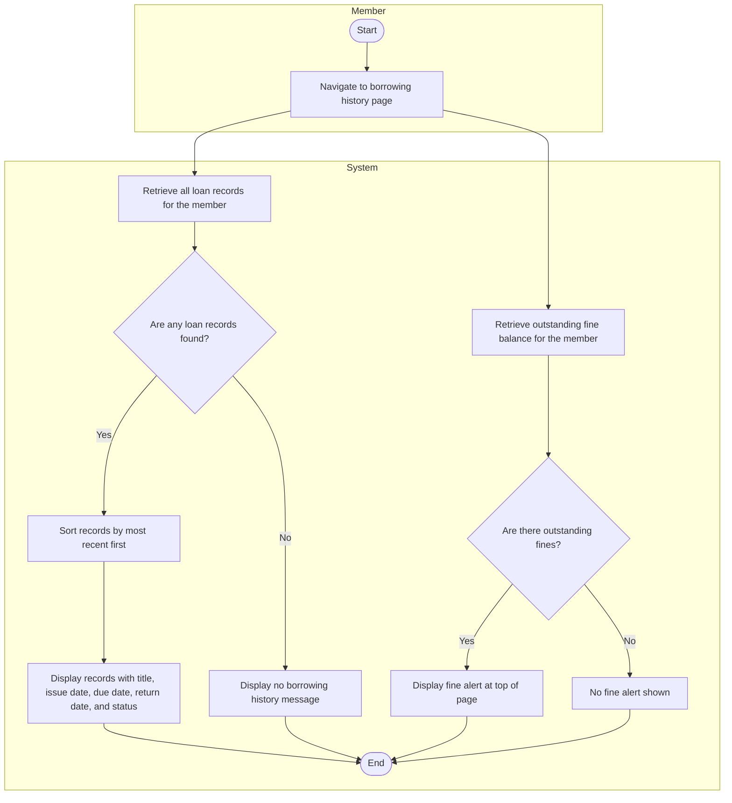
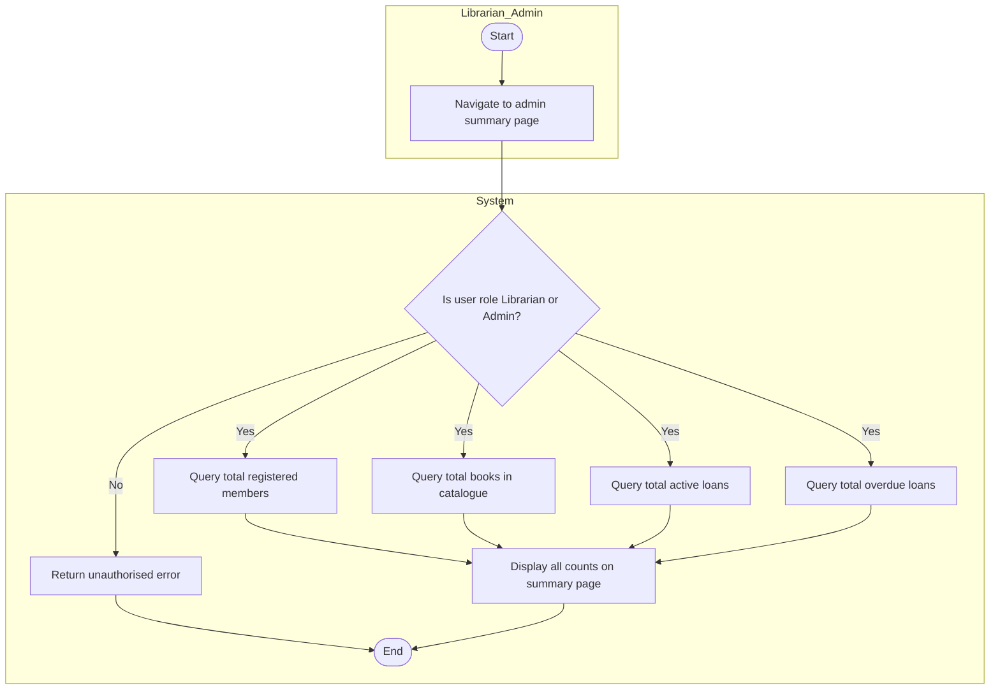

# ACTIVITY-DIAGRAMS.md — Smart Library Management System

---

## Activity Workflow Modeling

Below are the activity diagrams for the main workflows in the system. Each one breaks down a process step by step, showing where decisions are made, where actions happen at the same time, and which actor is responsible for each part using swimlanes.

---

## 1. User Registration

**Linked Requirement:** FR-01
**Linked User Story:** US-001
**Linked Sprint Task:** T-004 — Develop user registration API endpoint

**Explanation:**
Once the account is saved the system redirects the member to the login page and displays a success message at the same time, since neither of those actions depends on the other. This workflow covers FR-01 and directly addresses what the New Member stakeholder needs, being able to register and get started without any unnecessary steps or delays.

---

## 2. User Login

**Linked Requirement:** FR-02
**Linked User Story:** US-002
**Linked Sprint Task:** T-005 — Develop login API endpoint with JWT token generation

**Explanation:**
This workflow covers the login process from start to finish. I used a generic error message for invalid credentials on purpose so the system does not reveal whether it was the email or the password that was wrong, which is a basic but important security decision. The JWT token carries the user role so the system knows which dashboard to send them to after login. This covers FR-02 and the System Administrator stakeholder's concern about making sure people can only access the parts of the system they are supposed to.

---

## 3. Search for a Book

**Linked Requirement:** FR-03
**Linked User Story:** US-003
**Linked Sprint Task:** T-007 — Develop book search API endpoint

**Explanation:**
This workflow covers how search works whether the member types something in or not. If the search field is left empty the system just returns everything in the catalogue rather than throwing an error, which feels more useful. Every result includes the availability status so the member can see right away whether a book can be borrowed without having to click into it. This covers FR-03 and the Library Member stakeholder's concern about knowing what is available before making a trip to the library.

---

## 4. Issue a Book Loan

**Linked Requirement:** FR-05
**Linked User Story:** US-005
**Linked Sprint Task:** Not in Sprint 1 — planned for future sprint

**Explanation:**
Once the librarian confirms the loan, the system creates the loan record and reduces the available copy count at the same time since neither of those things needs to wait for the other. This covers FR-05 and what the Librarian stakeholder cares about most, which is not having to manually update records every time a book goes out.

---

## 5. Process a Book Return

**Linked Requirement:** FR-06
**Linked User Story:** US-006
**Linked Sprint Task:** Not in Sprint 1 — planned for future sprint

**Explanation:**
Once the return is confirmed, the system increases the available copy count and updates the loan status in the member's borrowing history at the same time since those two things do not depend on each other. After that it checks whether anyone has a reservation for the book and if so marks the next person in the queue as ready. This covers FR-06 and the Librarian stakeholder's need for fines to be calculated automatically, as well as FR-07 for keeping the reservation queue moving.

---

## 6. Reserve a Book

**Linked Requirement:** FR-07
**Linked User Story:** US-007
**Linked Sprint Task:** Not in Sprint 1 — planned for future sprint

**Explanation:**
Once the reservation is created, the system adds the member to the queue and shows them their position at the same time since one does not need to wait for the other. This covers FR-07 and what the Academic Staff stakeholder cares about most, which is being able to reserve a book and immediately know where they stand without having to follow up with anyone.

---

## 7. View Borrowing History

**Linked Requirement:** FR-08
**Linked User Story:** US-008
**Linked Sprint Task:** Not in Sprint 1 — planned for future sprint

**Explanation:**
When the member opens the borrowing history page, the system fetches the loan records and the outstanding fine balance at the same time since those are two separate queries that do not depend on each other. Running them in parallel means the page loads faster than if they ran one after the other. This covers FR-08 and the Library Member stakeholder's concern about always knowing what they have borrowed and what they owe.

---

## 8. Admin Summary Dashboard

**Linked Requirement:** FR-10
**Linked User Story:** US-010
**Linked Sprint Task:** Not in Sprint 1 — planned for future sprint

**Explanation:**
Once the user's role is verified, all four database queries run at the same time since none of them depend on each other. There is no reason to wait for one to finish before starting the next, so running them in parallel just makes the dashboard load faster. This covers FR-10 and what the Library Manager needs, which is being able to open the summary page and see everything up to date immediately without waiting around.

---

## Traceability Summary

| Diagram                 | Functional Requirement | User Story | Sprint Task   |
| ----------------------- | ---------------------- | ---------- | ------------- |
| User Registration       | FR-01                  | US-001     | T-004         |
| User Login              | FR-02                  | US-002     | T-005         |
| Search for a Book       | FR-03                  | US-003     | T-007         |
| Issue a Book Loan       | FR-05                  | US-005     | Future sprint |
| Process a Book Return   | FR-06                  | US-006     | Future sprint |
| Reserve a Book          | FR-07                  | US-007     | Future sprint |
| View Borrowing History  | FR-08                  | US-008     | Future sprint |
| Admin Summary Dashboard | FR-10                  | US-010     | Future sprint |
