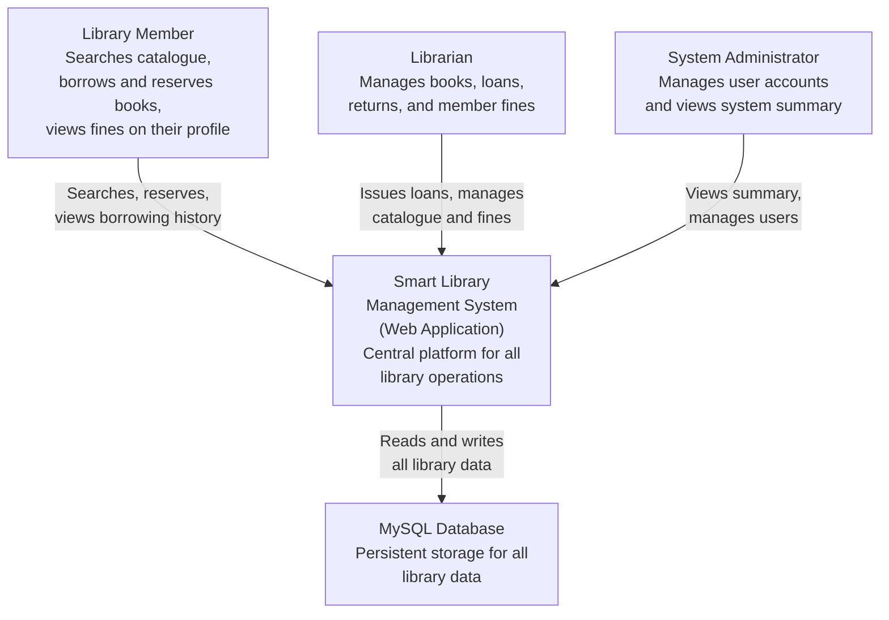
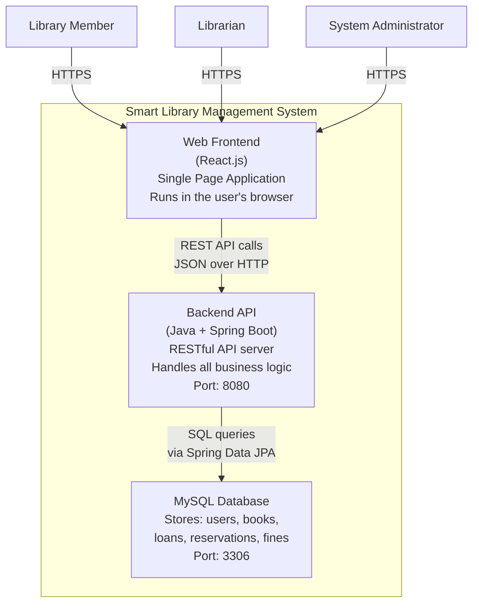
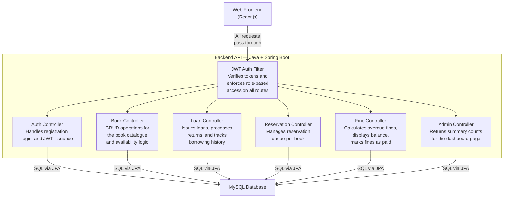
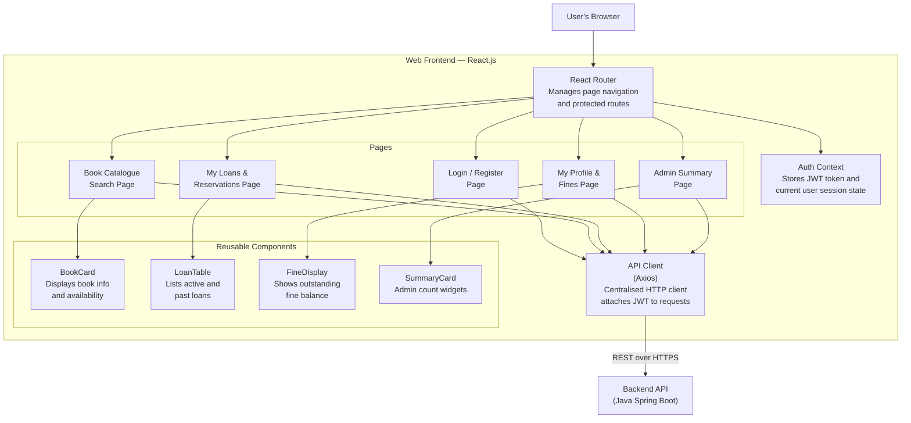
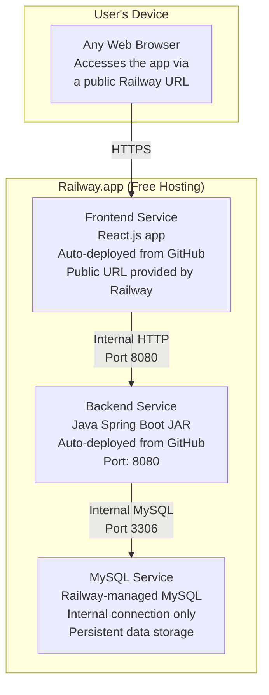
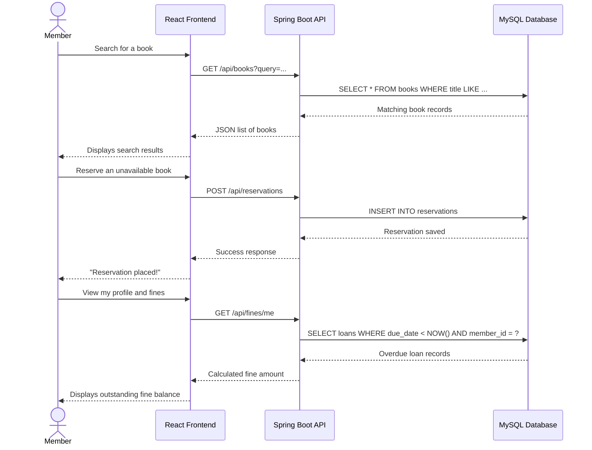

# ARCHITECTURE.md — Smart Library Management System

---

## 1. Project Title

**Smart Library Management System**

---

## 2. Domain

This system falls within the domain of Library and Information Services. This domain involves the organisation, storage, and lending of physical and digital resources to registered members. It is governed by borrowing rules, membership policies, and fine structures that vary between institutions but follow a consistent pattern.

---

## 3. Problem Statement

Many libraries continue to use outdated systems that members are unable to utilise outside of the library. This system aims to address this issue by providing a centralised web platform from which members can search and reserve books, as well as librarians can handle loans and fines...all through a browser. The architecture is intended to be simple, quick to deploy, and simple to manage.

---

## 4. Individual Scope & Feasibility Justification

Considering I am working on this individually over one semester, I made the architecture as minimal as possible. The system consists of three major components: a React frontend, a Spring Boot backend, and a MySQL database, all of which I am familiar with and can realistically build and deploy on my own within the time frame I have.

---

## 5. C4 Architectural Diagrams

To describe the architecture of this system, I used the C4 model, which allowed me to break it down into four layers, starting with who uses the system and gradually zooming in to show how each component is designed and where it runs.

| Level                    | Description                                                        |
| ------------------------ | ------------------------------------------------------------------ |
| **Level 1 – Context**    | Shows how the system fits into the world and who interacts with it |
| **Level 2 – Container**  | Shows the high-level technical building blocks of the system       |
| **Level 3 – Component**  | Zooms into a specific container to show its internal components    |
| **Level 4 – Deployment** | Shows how and where the system is hosted                           |

---

## 6. Level 1 — System Context Diagram

---

## 7. Level 2 — Container Diagram

---

## 8. Level 3 — Component Diagram (Backend API)

---

## 9. Level 3 — Component Diagram (Frontend Web App)

---

## 10. Level 4 — Deployment Diagram

---

## 11. End-to-End Data Flow

---

## 12. Key Architectural Decisions

| Decision             | Choice                      | Justification                                                                                                  |
| -------------------- | --------------------------- | -------------------------------------------------------------------------------------------------------------- |
| Frontend framework   | React.js                    | I chose React because I am already familiar with it and it works well for building single page applications    |
| Backend framework    | Java + Spring Boot          | Java is the language I am most comfortable with and Spring Boot makes it straightforward to build REST APIs    |
| Database             | MySQL                       | I chose MySQL because it fits well with the relational nature of library data and is easy to set up on Railway |
| Authentication       | JWT (JSON Web Tokens)       | JWT allows me to protect API routes and manage user roles without storing session data on the server           |
| Deployment           | Railway.app                 | Railway lets me deploy directly from GitHub without needing to configure servers or use Docker                 |
| Architecture pattern | MVC (Model-View-Controller) | MVC keeps my code organised by separating the data, business logic, and presentation layers clearly            |
