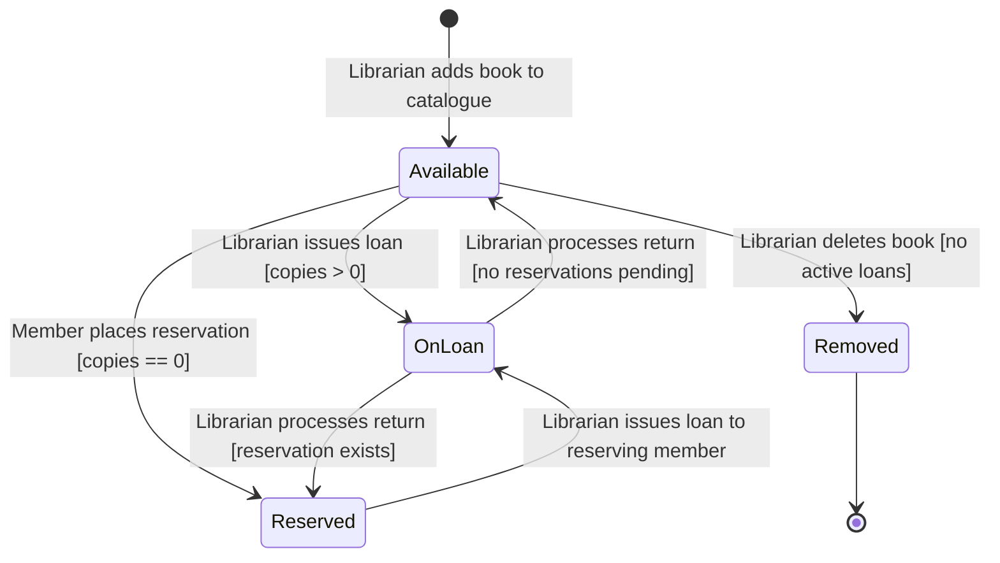
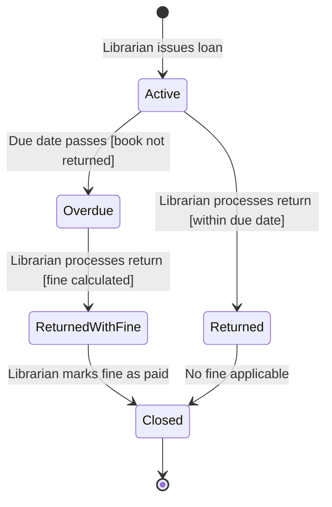
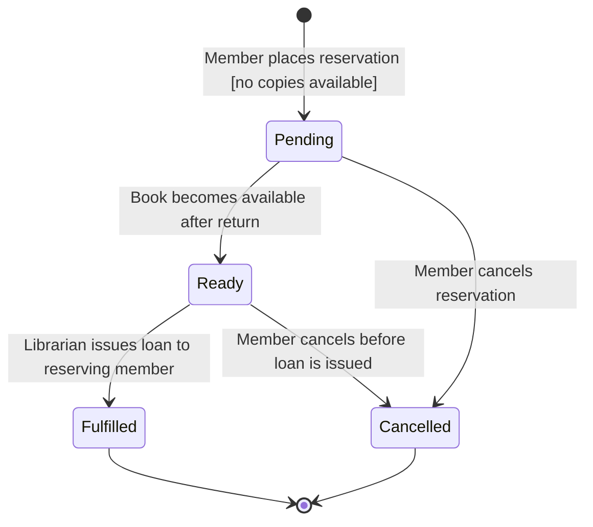
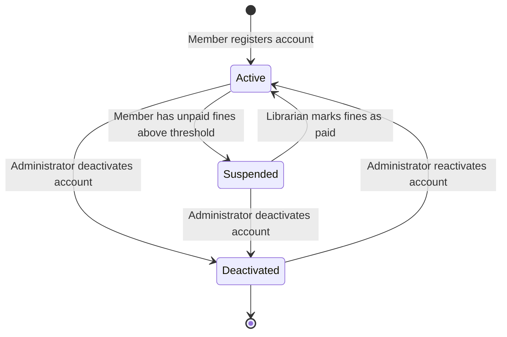
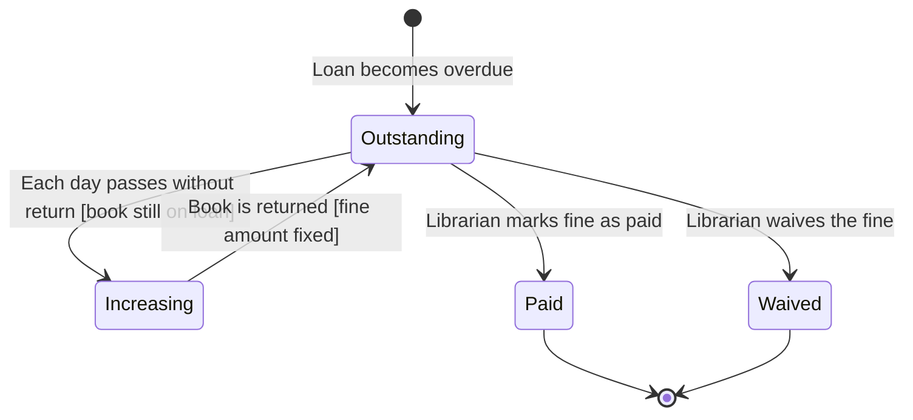
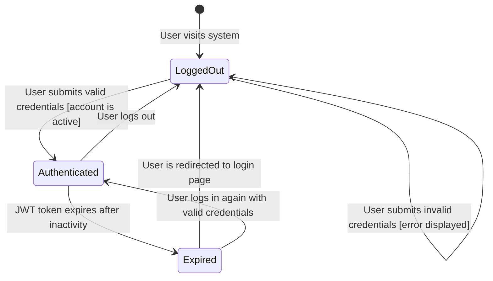
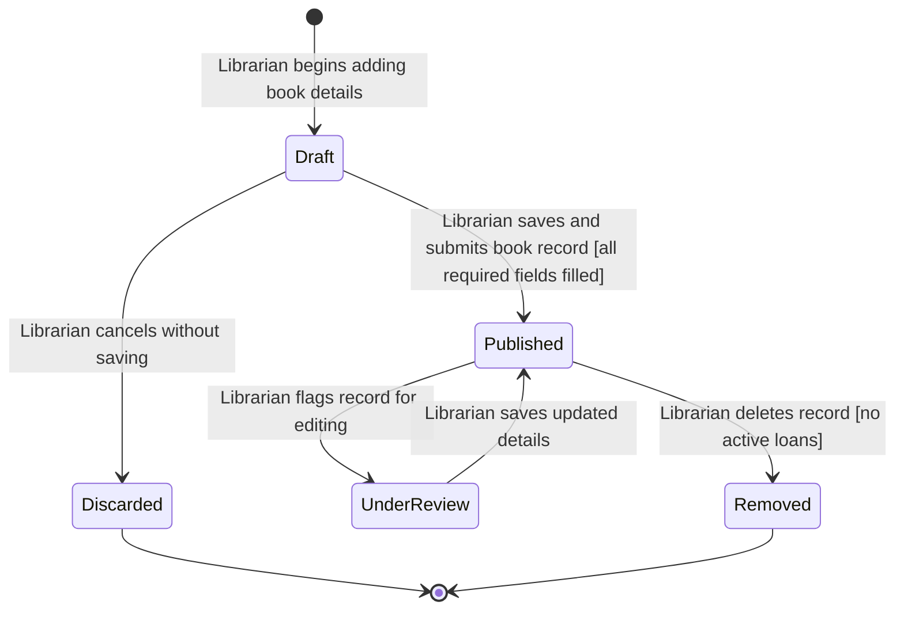
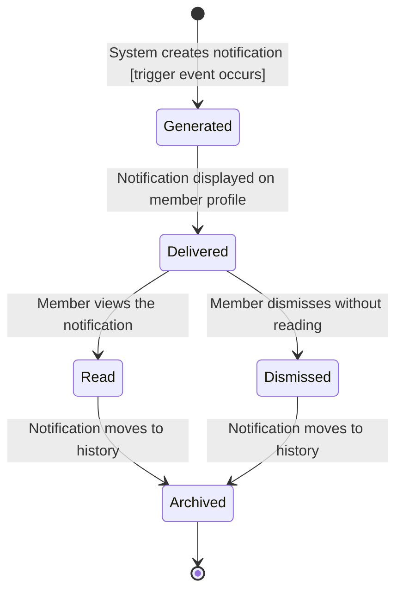

# STATE-DIAGRAMS.md — Smart Library Management System

---

## Object State Modeling

Below are the state transition diagrams for the main objects in the system. For each one I mapped out the different states the object can be in, what causes it to move from one state to another, and any conditions that need to be true before a transition can happen.

---

## 1. Book

**Linked Requirement:** FR-04, FR-05, FR-06
**Linked User Story:** US-004, US-005, US-006
**Linked Sprint Task:** T-008 — Develop book catalogue CRUD API endpoints

A book in the system can exist in several states depending on whether it is available, on loan, reserved, or removed from the catalogue.

**Key States and Transitions:**

- **Available** — The book has at least one copy that can be borrowed. This is the default state when a book is added to the catalogue.
- **OnLoan** — At least one copy has been issued to a member. The available copy count is reduced by one when this transition occurs.
- **Reserved** — All copies are on loan and one or more members are waiting. The system maintains a first-come-first-served queue.
- **Removed** — The book has been deleted from the catalogue by a librarian. This transition is only allowed if no active loans exist for the book.

**Guard Conditions:**

- A book can only transition to OnLoan if copies are available
- A book can only be removed if it has no active loans

---

## 2. Book Loan

**Linked Requirement:** FR-05, FR-06, FR-09
**Linked User Story:** US-005, US-006, US-009
**Linked Sprint Task:** Not in Sprint 1 — planned for future sprint

A loan record tracks the lifecycle of a single borrowing transaction from the moment a book is issued to when it is returned and any fines are resolved.

**Key States and Transitions:**

- **Active** — The loan has been issued and the due date has not yet passed.
- **Overdue** — The due date has passed and the book has not been returned. The system begins calculating fines at R2.00 per day.
- **Returned** — The book was returned on or before the due date. No fine is applied.
- **ReturnedWithFine** — The book was returned after the due date. A fine has been calculated and is outstanding on the member's profile.
- **Closed** — The loan is fully resolved. Either no fine was applicable or the fine has been marked as paid by a librarian.

**Guard Conditions:**

- Transition to Overdue only occurs if the due date has passed and the book is still marked as active
- Transition to Closed from ReturnedWithFine only occurs when a librarian marks the fine as paid

---

## 3. Book Reservation

**Linked Requirement:** FR-07, FR-12
**Linked User Story:** US-007, US-012
**Linked Sprint Task:** Not in Sprint 1 — planned for future sprint

A reservation tracks a member's place in the queue for a book that is currently unavailable.

**Key States and Transitions:**

- **Pending** — The reservation has been placed and the member is waiting in the queue.
- **Ready** — The book has been returned and this member is next in the queue. The book is being held for them.
- **Fulfilled** — The librarian has issued the loan to the reserving member. The reservation is complete.
- **Cancelled** — The member cancelled their reservation before it was fulfilled.

**Guard Conditions:**

- A reservation can only be placed if the book has zero available copies
- Transition to Ready only occurs when the book is returned and this member is first in the queue

---

## 4. Member Account

**Linked Requirement:** FR-01, FR-02, FR-11
**Linked User Story:** US-001, US-002, US-011
**Linked Sprint Task:** T-004 — Develop user registration API endpoint, T-005 — Develop login API endpoint

A member account moves through states from the moment it is registered to when it is deactivated or closed.

**Key States and Transitions:**

- **Active** — The account is in good standing and the member can log in and borrow books.
- **Suspended** — The member has outstanding fines that prevent them from borrowing additional books. They can still log in and view their account.
- **Deactivated** — The account has been deactivated by an administrator. The member cannot log in.

**Guard Conditions:**

- Transition to Suspended only occurs when unpaid fines exceed the threshold
- Transition from Deactivated to Active requires administrator action

---

## 5. Fine

**Linked Requirement:** FR-09
**Linked User Story:** US-009
**Linked Sprint Task:** Not in Sprint 1 — planned for future sprint

A fine is created when a loan becomes overdue and tracks whether it has been paid or waived.

**Key States and Transitions:**

- **Outstanding** — The fine exists and is owed by the member.
- **Increasing** — The book has not yet been returned and the fine amount grows at R2.00 per day.
- **Paid** — The librarian has recorded that the member paid the fine in person.
- **Waived** — The librarian has chosen to waive the fine, for example in cases of extenuating circumstances.

**Guard Conditions:**

- Fine remains in Increasing state as long as the book has not been returned
- Transition to Paid or Waived requires librarian action

---

## 6. User Session

**Linked Requirement:** FR-02
**Linked User Story:** US-002
**Linked Sprint Task:** T-005 — Develop login API endpoint, T-006 — Implement JWT auth filter

A user session tracks the authentication state of a user from login to logout or expiry.

**Key States and Transitions:**

- **LoggedOut** — The user is not authenticated. They can only access the login and registration pages.
- **Authenticated** — The user has a valid JWT token and can access features based on their role.
- **Expired** — The JWT token has expired due to inactivity. The user must log in again.

**Guard Conditions:**

- Transition to Authenticated only occurs if credentials are valid and the account is active
- Transition to Expired occurs automatically after the token lifetime elapses

---

## 7. Catalogue Entry (Book Record)

**Linked Requirement:** FR-04
**Linked User Story:** US-004
**Linked Sprint Task:** T-008 — Develop book catalogue CRUD API endpoints

A catalogue entry represents the administrative record of a book in the system and tracks whether it is published, under review, or removed.

**Key States and Transitions:**

- **Draft** — The librarian has started entering book details but has not yet saved the record.
- **Published** — The book record is complete and visible in the catalogue search.
- **UnderReview** — The librarian has opened the record for editing. It remains visible but changes are pending.
- **Removed** — The record has been permanently deleted from the catalogue.
- **Discarded** — The librarian cancelled the new entry before saving.

**Guard Conditions:**

- Transition from Draft to Published only occurs if all required fields are filled
- Transition to Removed only occurs if the book has no active loans

---

## 8. Notification

**Linked Requirement:** FR-09, FR-07
**Linked User Story:** US-007, US-009
**Linked Sprint Task:** Not in Sprint 1 — planned for future sprint

A notification tracks the lifecycle of a system alert sent to a member, such as a fine alert or reservation update.

**Key States and Transitions:**

- **Generated** — A trigger event such as an overdue loan or reservation update has caused the system to create a notification.
- **Delivered** — The notification is visible on the member's profile page.
- **Read** — The member has viewed the notification.
- **Dismissed** — The member dismissed the notification without reading it.
- **Archived** — The notification has been moved to the member's notification history.

**Guard Conditions:**

- Transition to Generated only occurs when a relevant trigger event takes place, such as a fine being applied or a reservation becoming ready
