# USE-CASE-DIAGRAM.md — Smart Library Management System

---

## Use Case Diagram

```mermaid
graph TD
    %% Actors
    Member(["Library Member"])
    Librarian(["Librarian"])
    Admin(["System Administrator"])
    Manager(["Library Manager"])
    Academic(["Academic Staff"])
    NewMember(["New Member"])

    %% Use Cases
    UC1["Register Account"]
    UC2["Login"]
    UC3["Search Books"]
    UC4["Reserve Book"]
    UC5["View Borrowing History"]
    UC6["View Fines"]
    UC7["Issue Book Loan"]
    UC8["Process Book Return"]
    UC9["Manage Book Catalogue"]
    UC10["Mark Fine as Paid"]
    UC11["View Admin Summary"]
    UC12["Manage User Accounts"]
    UC13["View Reservations"]
    UC14["Check Availability"]

    %% Member interactions
    Member --> UC2
    Member --> UC3
    Member --> UC4
    Member --> UC5
    Member --> UC6
    Member --> UC13

    %% New Member interactions
    NewMember --> UC1
    NewMember --> UC2

    %% Academic Staff inherits Member
    Academic --> UC2
    Academic --> UC3
    Academic --> UC4
    Academic --> UC5
    Academic --> UC13

    %% Librarian interactions
    Librarian --> UC2
    Librarian --> UC7
    Librarian --> UC8
    Librarian --> UC9
    Librarian --> UC10
    Librarian --> UC11

    %% Admin interactions
    Admin --> UC2
    Admin --> UC12
    Admin --> UC11

    %% Manager interactions
    Manager --> UC2
    Manager --> UC11

    %% Include relationships
    UC4 -->|"includes"| UC14
    UC7 -->|"includes"| UC14
```

---

### Key Actors and Their Roles

**Library Member**
A registered member of the library and the main person the system is built for. They use the system to search for books, borrow them, make reservations when something is unavailable, and keep track of what they owe in fines.

**New Member**
Someone who has never used the system before and is just getting started. Their only interactions at this point are creating an account and logging in for the first time. Once that is done they have the same access as any other Library Member.

**Academic Staff**
Lecturers and researchers who use the system the same way a regular member would, but their borrowing patterns are different. They tend to need multiple books at a time and rely heavily on reservations because the titles they need are often already borrowed by students. They share the same use cases as a Library Member.

**Librarian**
A staff member who handles the day to day running of the library through the system. They are the ones issuing loans when members want to borrow something, processing returns, keeping the catalogue up to date, and recording when fines have been paid.

**System Administrator**
Someone on the technical side who looks after user accounts and makes sure people have the right level of access. If an account needs to be created, updated, or deactivated, this is the person who handles it.

**Library Manager**
A senior staff member who is not involved in the day to day tasks like issuing loans or managing the catalogue, but needs to know how the library is performing overall. Their main reason for using the system is to check the summary dashboard and see the numbers that matter to them.

---

### Relationships Between Actors and Use Cases

**Inclusion Relationships**
Two use cases use an include relationship because they always depend on another use case being completed first:

- **Reserve Book includes Check Availability** — before a member can reserve a book the system must first check whether the book is currently available or not. A reservation only makes sense if the book has no available copies.
- **Issue Book Loan includes Check Availability** — before a librarian can issue a loan the system must verify that at least one copy is available to be borrowed.

**Generalisation**
Academic Staff use the system in exactly the same way as a regular Library Member, so rather than listing all the same use cases twice I treated Academic Staff as a more specific version of the Member actor. The only real difference is why they are borrowing, not how they do it.

---

### How the Diagram Addresses Stakeholder Concerns from Assignment 4

| Stakeholder          | Concern                                       | Use Case That Addresses It                       |
| -------------------- | --------------------------------------------- | ------------------------------------------------ |
| Library Member       | Check availability before visiting            | UC14: Check Availability, UC03: Search Books     |
| Library Member       | Keep track of fines                           | UC06: View Fines                                 |
| Librarian            | See all loans and process returns efficiently | UC07: Issue Book Loan, UC08: Process Book Return |
| Librarian            | Manage catalogue without hassle               | UC09: Manage Book Catalogue                      |
| Librarian            | Record fine payments                          | UC10: Mark Fine as Paid                          |
| System Administrator | Manage user accounts centrally                | UC12: Manage User Accounts                       |
| Library Manager      | Get a quick overview of library activity      | UC11: View Admin Summary                         |
| Academic Staff       | Reserve books and track reservations          | UC04: Reserve Book, UC13: View Reservations      |
| New Member           | Register and get started quickly              | UC01: Register Account                           |
